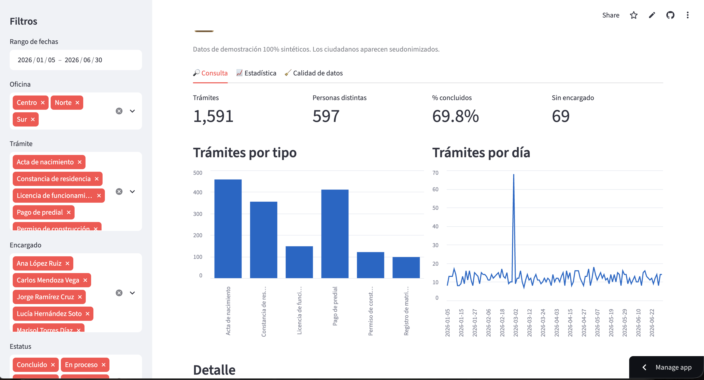
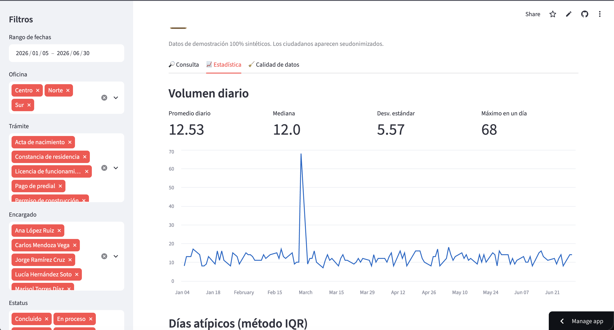
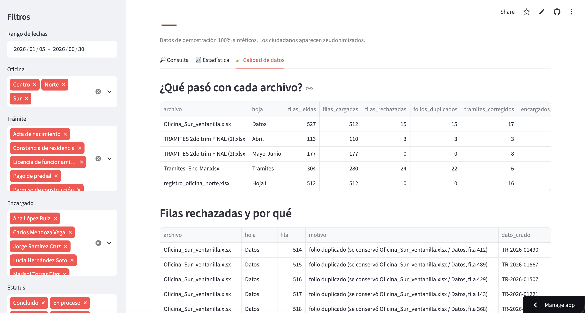

# 📋 Centralizador de Trámites

> **ETL en Python que convierte Excel desordenados de oficinas de gobierno en una base de datos limpia, consultable desde una app web sin saber SQL.**

[](https://www.python.org/)
[](https://streamlit.io/)
[](https://www.sqlite.org/)
[](tests/)
[](LICENSE)

🔗 **Demo en vivo:** [centralizador-tramites.streamlit.app](https://centralizador-tramites.streamlit.app/)

> ⚠️ **Todos los datos son inventados.** El programa los genera solo, imitando los errores que suelen tener los archivos reales de las oficinas. No se usó información de ninguna dependencia.

---

## 🖼️ Vista previa





---

## 📑 Tabla de contenidos

- [Demo en vivo](#-demo-en-vivo)
- [El problema](#-el-problema-que-resuelve)
- [La solución](#-la-solución)
- [Resultados con los datos de prueba](#-qué-vas-a-ver-cuando-corras-todo)
- [Cómo instalarlo y correrlo](#-cómo-instalarlo-y-correrlo)
- [Estructura del proyecto](#-estructura-del-proyecto)
- [Decisiones importantes](#-decisiones-importantes-y-por-qué)
- [Limitaciones](#-limitaciones-lo-que-este-prototipo-todavía-no-hace)
- [Siguientes pasos](#-siguientes-pasos)
- [Glosario para no técnicos](#-antes-de-empezar-glosario-para-no-técnicos)
- [Comandos de referencia rápida](#-bonus-comandos-de-referencia-rápida)
- [Preguntas frecuentes](#-preguntas-frecuentes)

---

## 🚀 Demo en vivo

Prueba la aplicación **sin instalar nada**:

👉 **[centralizador-tramites.streamlit.app](https://centralizador-tramites.streamlit.app/)**

Cosas que puedes hacer en la app:

- 🎛️ **Filtrar** por rango de fechas, oficina, trámite, encargado y estatus.
- 📊 **Ver KPIs** en tiempo real: trámites totales, personas distintas, % concluido, sin asignar.
- 📈 **Analizar tendencias** con gráficas de barras y líneas.
- 🧹 **Auditar la calidad** de los datos en la pestaña dedicada.
- ⬇️ **Descargar** el resultado filtrado en CSV o Excel.

---

## 🔥 El problema que resuelve

En muchas oficinas de gobierno, cada área lleva su propio Excel. Eso genera un caos cuando quieres juntar todo:

| Problema | Qué pasa en la práctica |
|---|---|
| **Encabezados distintos** | Un archivo dice `Folio`, otro `No. Folio`, otro `FOLIO`. Y en algunos el encabezado ni está en la primera fila: hay un título arriba. |
| **Fechas en 5 formatos** | A veces es una fecha normal, a veces texto (`04/03/2026`), a veces `12-abr-2026`, a veces un número raro (`46113`), y a veces está partida en 3 columnas: Día, Mes, Año. |
| **El mismo trámite escrito distinto** | `Acta de nacimiento`, `ACTA NACIMIENTO.`, `Acta de nacimeinto` (con error de dedo). |
| **Nombres inconsistentes** | `Ana López Ruiz`, `ANA LOPEZ`, `A. López`. ¿Son la misma persona? Sí, pero una computadora no lo sabe. |
| **Folios duplicados** | La misma oficina manda "reimpresiones" de trámites ya registrados. Si no se limpia, se cuentan doble. |
| **Basura** | Filas vacías, filas que dicen "TOTAL", fechas imposibles (año 2062), celdas en blanco. |

Hacerlo a mano con 4 archivos toma horas y siempre hay errores. **Este programa lo hace en segundos.**

---

## 💡 La solución

El proyecto tiene 4 etapas, como una línea de producción:

```
   Excel sucios       →   Limpieza (ETL)      →   Base de datos       →   Página web
   (data/raw)             en Python               (SQLite)                (Streamlit)
```

**Los archivos del proyecto y qué hace cada uno:**

| Archivo | Qué hace |
|---|---|
| `src/generar_exceles.py` | Fabrica 4 archivos de Excel "sucios" con datos falsos, para probar el sistema sin datos reales. |
| `src/etl.py` | **El corazón.** Lee los Excel, limpia todo (fechas, nombres, trámites, folios), detecta duplicados y guarda el resultado en la base de datos. **Nada se pierde en silencio**: cada fila que no se pudo usar queda guardada con la razón. |
| `sql/schema.sql` | Los planos de la base de datos: tablas, llaves, validaciones e índices. |
| `sql/vistas.sql` | Consultas guardadas que la app web usa. |
| `sql/consultas_ejemplo.sql` | 5 consultas SQL de ejemplo (JOIN, GROUP BY, HAVING, subqueries). |
| `src/estadistica.py` | Análisis estadístico: promedios, días con más trabajo y detección de "días raros" con IQR. |
| `app.py` | La página web que ves en el navegador. |
| `tests/test_etl.py` | 40 pruebas automáticas que revisan que todo funcione bien. |

---

## 📊 Qué vas a ver cuando corras todo

Con los datos de prueba:

```
1,633 filas leídas  →  1,591 cargadas  +  42 rechazadas con motivo
                       (exactamente las    (40 duplicados,
                        verdaderas)         1 fecha vacía, 1 fecha del 2062)
```

**Hallazgo estadístico:** el sistema detecta un **pico de 68 trámites el 27 de febrero de 2026** (cuando lo normal son unos 12 al día) y explica que **60 de esos son "Pago de predial" en la oficina Centro**. Esto coincide con el cierre del descuento por pronto pago que se simuló.

En otras palabras: el análisis **redescubre la verdad que se sembró en los datos**. Eso valida que funciona.

---

## ⚙️ Cómo instalarlo y correrlo

Vas a necesitar la **terminal** (en Windows se llama "Símbolo del sistema" o "PowerShell"; en Mac/Linux es "Terminal"). No te asustes: solo vas a copiar y pegar los comandos.

### Paso 0: Instalar Python

Si no tienes Python instalado:

- **Windows:** Descárgalo de [python.org/downloads](https://www.python.org/downloads/) y al instalar **marca la casilla "Add Python to PATH"** (¡muy importante!).
- **Mac:** Ya viene instalado, o instálalo con `brew install python`.
- **Linux/WSL:** `sudo apt install python3 python3-pip python3-venv`

Verifica que funcione:

```bash
python --version
```
Debe decir algo como `Python 3.11.x` o superior.

---

### Paso 1: Descargar el proyecto

**Opción A — Con Git (recomendado):**

```bash
git clone https://github.com/CeYaGlez/centralizador-tramites.git
cd centralizador-tramites
```

**Opción B — Sin Git:** Entra a la página del repositorio en GitHub, botón verde **"Code"** → **"Download ZIP"**, descomprime el archivo y abre la terminal dentro de esa carpeta.

---

### Paso 2: Crear y activar el entorno virtual

Esto es como crear una "cajita" limpia solo para este proyecto.

**Crear el entorno (todos los sistemas operativos):**
```bash
python -m venv venv
```
Esto crea una carpeta llamada `venv/` con una copia limpia de Python. Solo se hace **una vez**.

**Activar el entorno:**

| Sistema | Comando |
|---|---|
| **Windows (PowerShell)** | `.\venv\Scripts\Activate.ps1` |
| **Windows (CMD)** | `venv\Scripts\activate.bat` |
| **Mac / Linux / WSL** | `source venv/bin/activate` |

Cuando esté activo, verás `(venv)` al inicio de tu línea de comandos:
```
(venv) ➜ centralizador-tramites
```

> **Nota para Windows:** Si PowerShell te da un error de "no se puede cargar el archivo porque la ejecución de scripts está deshabilitada", abre PowerShell como administrador y corre:
> ```powershell
> Set-ExecutionPolicy -Scope CurrentUser -ExecutionPolicy RemoteSigned
> ```
> Después podrás activar el entorno normalmente.

> **Nota para WSL:** WSL es un "Linux dentro de Windows". Todos los comandos de Linux funcionan igual. Si no lo tienes instalado, abre PowerShell como administrador y corre `wsl --install`.

---

### Paso 3: Instalar las dependencias

Con el entorno virtual **activo** (con el `(venv)` visible):

```bash
pip install -r requirements.txt
```

Esto descarga las herramientas que el proyecto necesita (pandas, streamlit, openpyxl, pytest). Solo se hace **una vez**.

---

### Paso 4: Generar los datos de prueba y correr el ETL

```bash
python -m src.generar_exceles   # Crea 4 Excel sucios en data/raw/
python -m src.etl               # Los limpia y crea data/tramites.db
```

Si todo va bien, verás algo como:
```
Total: 1633 leídas | 1591 cargadas | 42 rechazadas
Base lista en .../data/tramites.db
```

**Si tienes datos reales:** cópialos a la carpeta `data/raw/` y corre solo `python -m src.etl`.

---

### Paso 5: Ver la página web

```bash
streamlit run app.py
```

Se abrirá automáticamente tu navegador en `http://localhost:8501`. Si no se abre, copia esa dirección y pégala manualmente.

**Para detener la página:** regresa a la terminal y presiona `Ctrl + C`.

---

### Paso 6 (opcional): Análisis en la terminal

Si quieres ver un resumen estadístico sin abrir la página web:

```bash
python -m src.estadistica
```

---

### Paso 7 (opcional): Correr las pruebas

```bash
pytest
```
Debe decir que las **40 pruebas pasaron**. Si algo falla, te dice exactamente qué.

---

## 📁 Estructura del proyecto

```
centralizador-tramites/
│
├── app.py                      ← Página web (Streamlit)
├── requirements.txt            ← Lista de programas que se instalan
├── README.md                   ← Este archivo
├── .gitignore                  ← Archivos que no se suben a GitHub
├── LICENSE                     ← Licencia MIT
│
├── data/
│   ├── raw/                    ← Aquí van los Excel (entrada)
│   └── tramites.db             ← Base de datos (salida, se genera sola)
│
├── sql/
│   ├── schema.sql              ← Estructura de la base de datos
│   ├── vistas.sql              ← Consultas guardadas
│   └── consultas_ejemplo.sql   ← Ejemplos de consultas
│
├── src/
│   ├── generar_exceles.py      ← Crea los Excel sucios de prueba
│   ├── etl.py                  ← Limpia y carga los datos
│   └── estadistica.py          ← Análisis estadístico
│
├── tests/
│   └── test_etl.py             ← 40 pruebas automáticas
│
└── docs/
    └── img/                    ← Capturas de pantalla
```

---

## 🧠 Decisiones importantes (y por qué)

- **Duplicados:** cuando el mismo folio aparece dos veces, se queda con la versión que tiene más datos completos. Si las dos versiones dicen cosas distintas (por ejemplo, fechas diferentes), avisa para que un humano lo revise.

- **Fechas ambiguas:** si una fecha es `04/03/2026`, se interpreta como **4 de marzo** (formato día/mes/año, como se usa en México). Es una suposición que hay que confirmar con cada oficina.

- **Encargados:** si el nombre viene incompleto o mal escrito, se marca como "Sin asignar", pero **el trámite sí se cuenta**. No se pierde información.

- **Privacidad:** el nombre del ciudadano **nunca se guarda en la base**. Solo se guarda un "hash" que permite contar personas distintas sin saber quiénes son.

- **Detección de días raros:** se usa un método llamado **IQR** en lugar del promedio normal, porque un solo día con muchísimos trámites distorsionaría el promedio y el pico se "escondería a sí mismo".

- **Seguridad:** los filtros de la página web nunca escriben directamente lo que el usuario teclea en la base de datos. Esto evita un tipo de hackeo llamado "inyección SQL".

- **Secretos en producción:** la "sal" del hash se guarda como secreto en Streamlit Cloud (`TRAMITES_SAL`), nunca en el código.

---

## ⚠️ Limitaciones (lo que este prototipo todavía no hace)

- Es un **prototipo con datos inventados**. Las reglas (qué trámites existen, qué encargados hay) son suposiciones y deben validarse con las personas que usan los Excel reales.

- **SQLite es para un solo usuario a la vez.** Para que 50 personas lo usen al mismo tiempo habría que migrar a PostgreSQL (otro tipo de base de datos) y agregar usuarios y contraseñas.

- **No hay autenticación.** La app es pública: cualquiera con el link puede verla. Para uso real habría que agregar login y roles.

- **Cada vez que corres el ETL, borra y reconstruye toda la base.** No es incremental: si tuvieras millones de registros, tardaría mucho.

- **La versión en la nube es de un solo proceso.** Si mucha gente entra al mismo tiempo, Streamlit Cloud puede tardar en responder.

---

## 🎯 Siguientes pasos

1. Validar la lista de trámites y encargados con el equipo real.
2. Hacer cargas incrementales (solo lo nuevo, no todo cada vez).
3. Migrar a PostgreSQL con usuarios y contraseñas, y desplegar en un servidor propio.
4. Agregar autenticación y roles a la app.
5. Conectar herramientas de BI (como Power BI o Metabase) a las mismas vistas.

---

## 🧠 Antes de empezar: glosario para no técnicos

Si nunca has programado, esta sección es para ti. Aquí explico las palabras raras que van a aparecer más adelante, con ejemplos cotidianos.

### ¿Qué es un "ETL"?
Son las siglas de **Extract, Transform, Load** (Extraer, Transformar, Cargar). Es como lavar ropa:

1. **Extraer** → agarras la ropa sucia del cesto (leer los Excel).
2. **Transformar** → la lavas, la secas y la doblas (limpiar y ordenar los datos).
3. **Cargar** → la guardas en el clóset (meter todo a una base de datos limpia).

Es el proceso que hace este proyecto: agarra los Excel sucios y los deja impecables en un solo lugar.

### ¿Qué es "SQL"?
Es el idioma que hablan las **bases de datos**. Una base de datos es como un archivador gigante con cajones y carpetas. SQL es el idioma que usas para pedirle cosas:

- *"Dame todos los trámites de marzo"*
- *"¿Cuántos trámites hizo Ana López?"*
- *"¿Qué día hubo más trabajo?"*

En este proyecto, **tú no necesitas escribir SQL**: la página web ya trae los filtros listos.

### ¿Qué es "SQLite"?
Es un **tipo de base de datos muy ligera**, que vive en un solo archivo (como un Excel, pero más poderoso). Es perfecta para proyectos pequeños. El archivo se llama `tramites.db` y se genera solo cuando corres el ETL.

### ¿Qué es "3FN" (Tercera Forma Normal)?
Es una regla que dice: **cada dato vive en un solo lugar**. Si tienes que cambiarlo en varios
lados, no estás en 3FN.

**Ejemplo — una agenda de contactos:**

❌ **Sin 3FN:** repites la ciudad en cada renglón.
```
Nombre | Teléfono | Ciudad
Ana    | 555-1234 | CDMX
Luis   | 555-5678 | CDMX
Sofía  | 555-9012 | CDMX
```
Si mañana "CDMX" cambia de nombre, tienes que editar **3 renglones**. Y si te equivocas en
uno, ya hay datos inconsistentes.

✅ **Con 3FN:** separas en dos tablitas y solo guardas el número.
```
Tabla "Ciudades"       Tabla "Contactos"
id | ciudad            Nombre | Teléfono | id_ciudad
1  | CDMX              Ana    | 555-1234 | 1
                       Luis   | 555-5678 | 1
                       Sofía  | 555-9012 | 1
```
"CDMX" se escribe **1 sola vez**. Si cambia, lo cambias en un solo lugar y se actualiza en
todos lados. Además, es imposible que alguien escriba "CDMX" de 5 formas distintas.

**En este proyecto**, los nombres de trámites, encargados y oficinas viven en tablitas
aparte (`tramite_tipo`, `encargado`, `oficina`). En la tabla grande (`registro`) solo se
guardan sus números. Por eso el ETL se esfuerza tanto en normalizar los nombres: para que
solo exista la versión oficial. 🐍

### ¿Qué es una "interfaz web"?
Es una **página web** que abres en tu navegador (Chrome, Safari, Edge) y con la que interactúas haciendo clic. Como cuando entras a tu banco en línea: llenas filtros, ves gráficas, descargas reportes. No necesitas saber nada de tecnología para usarla.

### ¿Qué es "Streamlit"?
Es una **herramienta de Python para hacer páginas web sin saber diseño**. En lugar de aprender HTML, CSS y JavaScript (los idiomas de las páginas web), escribes Python normal y Streamlit te arma la página con botones, tablas y gráficas automáticamente.

En este proyecto, `app.py` es el archivo que describe la página, y Streamlit la "dibuja" cuando lo ejecutas.

### ¿Qué es un "entorno virtual"?
Imagina que tu computadora es una casa y los programas de Python son muebles. Si instalas programas sin orden, la casa se llena de cosas que no usas y puede haber conflictos.

Un **entorno virtual** es como una **cajita aparte** dentro de la casa donde guardas solo los muebles (programas) que este proyecto necesita. Así:

- No ensucias el resto de tu computadora.
- Si otro proyecto necesita otra versión, no se pelean.
- Si algo se rompe, borras la cajita y empiezas de nuevo sin afectar nada más.

Se crea con el comando `python -m venv venv`.

### ¿Qué es "GitHub"?
Es como un **Google Drive para programadores**. Sirve para guardar tu código, ver quién cambió qué, y compartirlo con el mundo. Cada proyecto vive en un "repositorio".

### ¿Qué es "pytest"?
Es una herramienta que **revisa que tu programa funcione bien**. Tú escribes pruebas (por ejemplo: *"si le doy esta fecha, debe devolver este resultado"*) y pytest las corre todas automáticamente. Es como tener un inspector de calidad.

### ¿Qué es un "hash"?
Es una **licuadora de texto**: metes un nombre y sale una combinación sin sentido (ej. `María García` → `a3f7c9e1b2d4`). Tiene 3 propiedades:

1. **Siempre da lo mismo** → el mismo nombre siempre produce la misma mezcla.
2. **No se puede regresar** → de la mezcla no puedes recuperar el nombre.
3. **Cada nombre da algo distinto** → dos personas nunca comparten mezcla.

**¿Para qué sirve aquí?** Para **contar personas distintas sin saber quiénes son**. Si 5 trámites tienen el mismo hash, son la misma persona (sin saber su nombre).

**¿Y la "sal"?** Es un **ingrediente secreto** que se agrega antes de licuar, para que nadie pueda adivinar el nombre probando combinaciones comunes. En producción esa sal debe guardarse en una variable de entorno (`TRAMITES_SAL`) y mantenerse en secreto.

---

## 🎁 Bonus: comandos de referencia rápida

Guarda esta tablita a la mano:

| Tarea | Windows (PowerShell) | Mac / Linux / WSL |
|---|---|---|
| Crear entorno virtual | `python -m venv venv` | `python3 -m venv venv` |
| Activar entorno | `.\venv\Scripts\Activate.ps1` | `source venv/bin/activate` |
| Desactivar entorno | `deactivate` | `deactivate` |
| Instalar dependencias | `pip install -r requirements.txt` | `pip install -r requirements.txt` |
| Generar Excel de prueba | `python -m src.generar_exceles` | `python -m src.generar_exceles` |
| Correr ETL | `python -m src.etl` | `python -m src.etl` |
| Ver estadísticas | `python -m src.estadistica` | `python -m src.estadistica` |
| Abrir página web | `streamlit run app.py` | `streamlit run app.py` |
| Correr pruebas | `pytest` | `pytest` |
| Detener la página web | `Ctrl + C` | `Ctrl + C` |

---

## 🙋 Preguntas frecuentes

**¿Necesito saber programar para usarlo?**
Para instalarlo y correrlo, no. Solo copia y pega los comandos. Para modificarlo, sí necesitas aprender Python.

**¿Qué pasa si mi archivo de Excel tiene otro formato?**
Es probable que funcione, porque el ETL detecta encabezados automáticamente. Si falla, revisa la pestaña **"Calidad de datos"** de la página web: ahí dice qué filas no se pudieron cargar y por qué.

**¿Puedo usarlo con datos reales de mi oficina?**
Sí, pero **antes de hacerlo** revisa los temas de privacidad y aviso de privacidad de datos personales. Este prototipo está diseñado para **no guardar nombres**, solo un hash.

**¿Por qué tanto código para algo "simple"?**
Porque los datos del mundo real son sucios. El 70% del trabajo de un científico de datos es limpiar datos, no analizarlos. Este proyecto muestra cómo se hace bien.

**¿Cómo se despliega la app en la nube?**
Con [Streamlit Community Cloud](https://share.streamlit.io/), gratis. Solo conectas tu repositorio de GitHub, eliges `app.py` como archivo principal y configuras los secretos. La app se actualiza automáticamente con cada `git push`.

---

## ✅ Resumen en 30 segundos

1. Instala Python.
2. Clona el proyecto.
3. Crea un entorno virtual (`python -m venv venv`) y actívalo.
4. Instala dependencias (`pip install -r requirements.txt`).
5. Genera los datos de prueba y corre el ETL.
6. Abre la página con `streamlit run app.py`.
7. ¡Listo! Filtra, grafica y descarga.

---

## 📄 Licencia

MIT — ver [LICENSE](LICENSE) para más detalles.

---

<p align="center">
  Hecho con ☕ y 🐍 por <a href="https://github.com/CeYaGlez">Cesar Yahir González</a>
</p>
